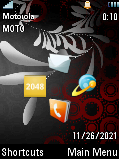

Magx Screenshot
===============

Different ways to take screenshots on MotoMAGX devices and emulators.

* [fbgrab.c](fbgrab.c) - EXL: Converting `/dev/fb/0` to BMP image.
* [jgrab.c](jgrab.c) - EXL: Converting `/dev/fb/0` to JPEG image.
* [zgrab.cpp](zgrab.cpp) - Ant-ON: Using transparent `QWidget` on top of screen.
* [dgrab.cpp](dgrab.cpp) - EXL: Using `QApplication::desktop()` and `QPixmap::grabWindow()` methods.

## Build

Install [MotoMAGX SDK]() and [MotoMAGX Emulator SDK]() then use `make` command.
// TODO: Add links to SDK

## Use

See help in each utility.

## Information

See "[Софт для ZN5 и прочих MotoMAGX: MGX и PEP, Разработка, портирование и обсуждение нативного софта](https://forum.motofan.ru/index.php?showtopic=163337)" thread (in Russian) on MotoFan.Ru forum.
